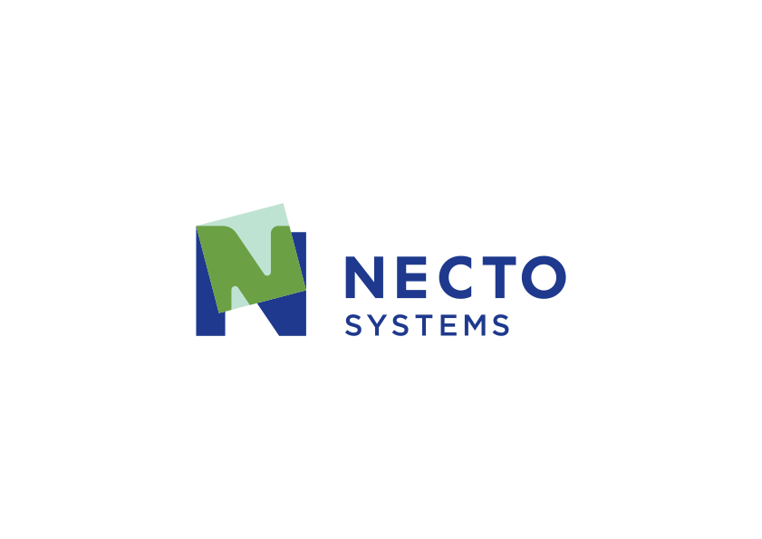

********************
Python - NetworkDays
********************

A lean and powerful Python library for business day calculations
----------------------------------------------------------------

No dependencies, just Python. Simple, fast, and efficient

--------------------------------------------------------------------------------------------

some statistics ...

+------------------------+----------------------+--------------------+---------------------+
| Pypi Version           | Doc Status           | Coverage           | Downloads           |
+========================+======================+====================+=====================+
|  |badge_pypi_version|  |  |badge_doc_status|  |  |badge_coverage|  |  |badge_downloads|  |
+------------------------+----------------------+--------------------+---------------------+

.. |badge_pypi_version| image:: https://img.shields.io/pypi/v/python-networkdays.svg?style=flat-square
    :target: https://pypi.org/project/python-networkdays
    :alt: pypi version

.. |badge_doc_status| image:: https://readthedocs.org/projects/networkdays/badge/?version=latest
    :target: https://networkdays.readthedocs.io/?badge=latest
    :alt: Documentation Status

.. |badge_coverage| image:: https://codecov.io/gh/cadu-leite/networkdays/branch/master/graph/badge.svg
    :target: https://codecov.io/gh/cadu-leite/networkdays
    :alt: code coverage

.. |badge_downloads| image:: https://img.shields.io/pypi/dm/wagtail-seo
    :target: https://pypi.org/project/python-networkdays
    :alt: Downloads on Pypi

--------------------------------------------------------------------------------------------

**Tired of heavy libraries for simple date calculations?**

`networkdays` is the solution you've been looking for. A pure Python library, **with no dependencies**, to calculate business days between dates, quickly and efficiently. Ideal for Python developers and data scientists who value simplicity and performance.

Why choose `networkdays`?
=========================

*   **🚀 Lightweight and Fast:** Without the weight of external dependencies. Perfect for microservices, scripts, and projects where every millisecond counts.
*   **🧘‍♀️ Simple and Intuitive:** A clear and straightforward API that resembles the spreadsheet functions you already know.
*   **💪 Flexible and Powerful:** Support for custom holidays and days off, adapting to any calendar.
*   **📅 Project Planning:** Calculate work schedules based on effort hours and business days.

Get started now!
================

Install `networkdays` with `pip` and start simplifying your date calculations today.

.. code-block:: bash

    pip install python-networkdays

.. tip::
    Note that the package name on PyPI is `python-networkdays`, but you import it as `networkdays`.

Practical Examples
==================

Calculate business days between two dates
-----------------------------------------

Just like in your favorite spreadsheet, calculate the working days, disregarding weekends and holidays.

.. code-block:: python

    from datetime import date
    from networkdays import Networkdays

    # Define the holidays
    HOLIDAYS = {date(2024, 12, 25), date(2025, 1, 1)}

    # Create a Networkdays instance
    workdays = Networkdays(
        date(2024, 12, 20),  # Start date
        date(2025, 1, 10),   # End date
        HOLIDAYS             # List of holidays
    )

    # Get the list of workdays
    day_list = workdays.networkdays()
    print(f"There are {len(day_list)} working days.")
    # There are 14 working days.

    # You can also list the weekends and holidays in the period
    print(f"Holidays: {workdays.holidays()}")
    # Holidays: [datetime.date(2024, 12, 25), datetime.date(2025, 1, 1)]

    print(f"Weekends: {workdays.weekends()}")
    # Weekends: [datetime.date(2024, 12, 21), datetime.date(2024, 12, 22), ... ]

Plan your Project
-------------------

Estimate the end date of a project based on working hours.

.. code-block:: python

    from datetime import date
    from networkdays import JobSchedule

    # Plan a 120-hour project, with 8 working hours per day,
    # starting on July 1, 2024.
    schedule = JobSchedule(
        project_duration_hours=120,
        workhours_per_day=8,
        date_start=date(2024, 7, 1)
    )

    print(f"The project will take {schedule.bussines_days} business days.")
    # The project will take 15 business days.

    print(f"Starts on: {schedule.prj_starts}")
    # Starts on: 07/01/24

    print(f"Ends on: {schedule.prj_ends}")
    # Ends on: 07/19/24

    # Analyze the work distribution
    print(f"Project years: {list(schedule.years())}")
    # Project years: [2024]

    print(f"Project months: {list(schedule.months())}")
    # Project months: [7]

Total Flexibility
-------------------

Work on Saturdays? No problem. `networkdays` adapts to your needs.

.. code-block:: python

    from datetime import date
    from networkdays import Networkdays

    # Consider only Sunday as a day off (1=Mon, 7=Sun)
    saturday_workdays = Networkdays(
        date(2024, 7, 1),
        date(2024, 7, 31),
        weekdaysoff={7}  # Only Sundays
    )

    print(f"Working days in July (working on Saturdays): {len(saturday_workdays.networkdays())}")
    # Working days in July (working on Saturdays): 27

Complete Documentation
======================

For more details and examples, access our official documentation:

https://networkdays.readthedocs.io/

Contributions
=============

Contributions are always welcome! Feel free to open an issue or submit a pull request.

Code of Conduct
===============

Everyone interacting with the project must follow our `Code of Conduct <CODE_OF_CONDUCT.md>`_.

License
=======

This project is licensed under the MIT license. See the `LICENSE` file for more details.

